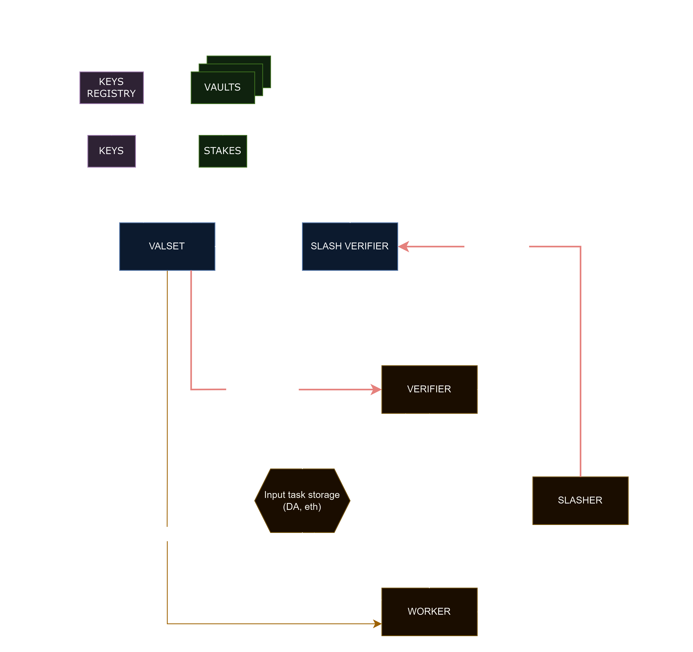
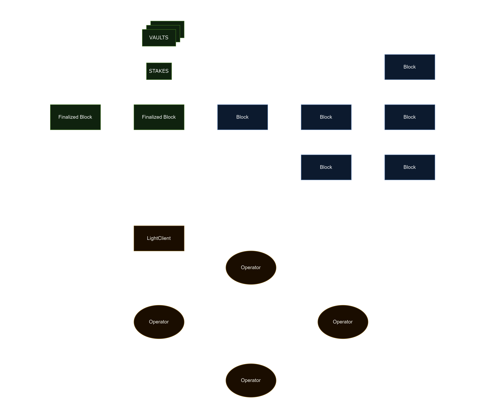

# Symbiotic cosmos-sdk example (stubchain)

## Context
Symbiotic is a shared security protocol that serves as a thin coordination layer, empowering network builders to control and adapt their own (re)staking implementation in a permissionless manner. It provides flexible (re)staking infrastructure for networks, operators, and stakers.

Our ecosystem allows anyone to build their ideal staking/restaking model using:

- Ready-to-go open-source components
- Custom modules compatible with Symbiotic Core

> 💡 Symbiotic Core standardizes crucial elements of (re)staking such as stake accounting, slashing, and delegations.

In this repository, we introduce the [abstract representation](#network-abstraction) of any network that can be built on Symbiotic. We also provide an example network implementation with both an on-chain [middleware part](#simplemiddleware) and an off-chain [Cosmos-based part](#stubchain). 

# Network Abstraction

Before we dig into technicalities, let’s define the network model and its key parts. The way we define this model is maximally abstract to support any kind of network.



In general, the network can be represented as:

- `VALSET` is a part of network middleware deployed on the Ethereum network that provides information about validators (keys and stakes) working in the network. For example, it can filter them by minimal stake or implement a schedule for the validators.
- `SLASH VERIFIER` is a part of network middleware deployed on the Ethereum network. It receives slashing requests, validates the sender and the requests themselves, and then interacts with vaults to request the slashing of the operator.
- `VERIFIER` is a mechanism for validating the results of the operator's work. For example, in the oracle network, the verifier can be a contract that checks the validity of aggregated signatures from oracles. The verifier can be located on Ethereum as a smart contract, removing trust assumptions on the delivery of information from the `VERIFIER` to `SLASH` `VERIFIER`. The `VERIFIER` can also be on another chain, which introduces some trust assumptions for such delivery.
- `SLASHER` is a mechanism of slashing in the network. It consists of rules and methods to check for participant misbehavior. It also includes how slashing requests are delivered to the `SLASH VERIFIER`. For example, it can be a module of the PBFT protocol or an ordinary EOA if the network uses fraud proofs for slashing.
- **`Input task storage`** is a place where tasks are stored. It can be a mempool with transactions, some DA, a smart contract on Ethereum with requests and so on, depending on the network specification.
- `INPUT TASK` : The required input data for computation. It might be empty if the computation doesn’t require any input.
- `OUTPUT`: The result of the computation.
- `WORKER`: operators, groups of operators, or a separate operator. For example, in the provers market network, a `WORKER` can be a separate operator. However, in a network with some consensus engine a `WORKER` is likely a majority of validators from `VALSET`.

With the following functionality:

- `COMPUTE(VALSET, INPUT TASK) -> OUTPUT`: This function represents the main business logic of the network, such as price updates in the case of an oracle, or state transition in the case of a rollup.
- `VERIFY(VALSET, INPUT TASK, OUTPUT) -> Boolean`: This function is responsible for verifying the correctness of the `OUTPUT` against `VALSET` and `INPUT`.
- `SLASH(VALIDATOR, AMOUNT)`: This function is responsible for slashing the validator by `AMOUNT`.

We assume that all of this components except `COMPUTE` are sitting on-chain in `NetworkMiddleware` contract.

In this abstraction Symbiotic key goal is to provide convenient way to maintain `VALSET` by:

- Symbiotic core contracts are providing stakes and ability to slash this stake with strong guarantees over time
- Symbiotic SDK contracts are providing the set of open-source components to build:
    - Operators election and stakes aggregation from many vaults
    - Operators key management
    - Slashing distribution across many vaults
    - Rewards distribution to operators and vaults

As we defined in the previous section, a network needs to implement the `NetworkMiddleware` contract to interact with Symbiotic core contracts.

We don’t require networks to use a specific implementation of the `NetworkMiddleware`. Instead, we define the Core API and provide fully open-source SDK modules and examples to simplify the integration process.

The `NetworkMiddleware` consists of two main parts: `VALSET`and `SLASH VERIFIER`.

## Network flow

### task→input task storage→worker→verifier

The network receives tasks from users and stores them in what we call input task storage. We do not specify exactly how tasks are stored; it can range from a complicated DA layer to a trivial immediate execution that does not require storing tasks (although the trivial storage is still considered storage).

Then the tasks from the storage are delivered to the **WORKER**(we can simplify it here and call workers "operators"). In practically every network, the results of the operator’s work should be checked somehow. So, the results of the operator's work are delivered to the VERIFIER. Even in fraud-proof systems, we can outline what the **VERIFIER** might look like. To perform a fraud-proof check, it must be verifiable onchain. However, the way this data is delivered to the chain, where the fraud proof is checked, is itself a result delivery from the **WORKER** to the **VERIFIER**.

### valset→worker, verifier

In general, in every network, information about VALSET must be delivered to the WORKER. Operators should understand when they are eligible to work in the Network.

In some networks, it is essential to deliver VALSET to the VERIFIER as well. The VERIFIER can use this information to validate the operator’s work, such as eligibility and voting powers.

If core components of the network are not located on Ethereum, VALSET delivery can be made verifiable when a party signs a message with the actual VALSET. This message can then be used in fraud proofs for on-chain verification. If core components of the network, like WORKER and VERIFIER, are located on Ethereum, there are no trust assumptions on such delivery.

### slasher → slash verifier → request slash

As mentioned, SLASHER is a mechanism for slashing in the network. Using information from modules like VERIFIER and WORKER, it determines when the operator must be slashed. However, the slashing is executed on the Ethereum chain, so the slashing information must be delivered to Ethereum. SLASH VERIFIER checks the sender of the slashing request, validates the calldata, and if all conditions are met, initiates the slashing process. Sometimes it requires data from the network’s VERIFIER, which can be on another chain. Slashing data can be delivered by a trusted party, aggregated key, directly in the chain, natively to the chain, etc. So the main question here is how exactly it is delivered to and verified in SLASH VERIFIER.

## SimpleMiddleware

[SimpleMiddleware contracts](./middleware/) serve as an example of how typical middleware can be implemented. Next, we describe the functionality of the contracts and possible improvements.

In the contracts, there is an admin role that can call important functions of the middleware. However, as mentioned, the code is an example, and in real production networks, it can be implemented differently.

The Example network uses epochs to divide time into consecutive blocks of equal size. Each epoch has its own validator set, including keys and stakes, which the network captures at the start of every epoch.

Note that this middleware implements the logic of VALSET and SLASH VERIFIER from the network abstraction section, as well as other functionalities.

### Register operators and vaults

Any operator needs a stake to be eligible to work in the network. The source of the stakes is a vault. Therefore, any network should clarify which operators and vaults it accepts. This process is called opt-in mechanics and is described in the official docs. In Simple middleware contracts, there is a `registerVault` method that performs opt-in to the vault. It also checks and validates the epoch size of the vault and the type of slasher in the vault. Any vault can also be paused and unpaused on the middleware side. However, this is not related to the Symbiotic functionality and is implemented only for example purposes.

Since operators use different nodes with different keys, SimpleMiddleware can register and deregister keys of the operator. There are `registerOperator` and `updateOperatorKey` methods that allow this.

### Get Validator Set

To get the validator set, there is a `getValidatorSet` method that iterates over all registered operators in the middleware and calculates their stakes at the given epoch. This function can be called to get the actual validator set for the current epoch or to identify validators elected in previous epochs. Note that this method can be implemented in different ways, including:

1. Storing different keys for the same operator
2. Checking the minimal stake amount of the operator
3. Splitting the stake of the operator across its keys
4. Introducing a schedule for the operators
5. Updating VALSET when cross-slashing incidents happen

As mentioned, this method is just an example of how a validator set can be implemented.

### Slashing

If an operator misbehaves, it must be slashed. To do this in the middleware, use the `slash(epoch, operator, amount)` method. This method iterates over all the operator’s vaults and slashes the operator proportionally. The epoch argument is related to the network’s epoch because an operator can be slashed not immediately but after some time.

Slashing can be implemented in other ways, including:

1. Custom slashing rules excluding proportional slashing
2. Caching slash incidents and sending them all at once
3. Additional verification of slashing requests, for example, when the network uses fraud proofs
4. Using an aggregated key from the majority of operators instead of a specific role to send slash requests

This method is essentially the SLASH VERIFIER from the network abstraction section but with basic verification.

## Stubchain

[Symbiotic stubchain](./symapp/) serves as an example network that can be built on the Symbiotic system. It is created using the Cosmos SDK with several differences.



Instead of the basic delegation module, validators use voting power as stakes in Symbiotic. To get the stakes, a validator first retrieves the last finalized block from the BeaconChain Client and then calls Network Middleware view functions at the given block height. Each node requires its own BeaconChain client. The Cosmos SDK only replicates the given voting power.

There are other minor differences including:

1. **Slashing module is changed**
    
    Only inactivity penalties (jail) are retained; others are removed.
    
2. **Government module is changed**
    
    The delegation module is removed.
    
3. **GenUtil module is changed**
    
    Delegation-related arguments are removed.
    
4. **App is changed**
    
    NFT mint, Distribution, Fee grant, and Evidence are removed.
    
5. **Required environment arguments:**
    1. Middleware address
    2. Beacon RPC URL
    3. ETH RPC URL
    4. Debug flag (for unfinalized canonical block)

### Modules
- /x/symStaking <- x/staking
- /x/symSlash <- x/slashing
- /x/symGov <- x/gov
- /x/symGenutil <- x/genutil

### Build
```bash
make build-sym
```

### Run
See [`symapp`](symapp/README.md) directory
